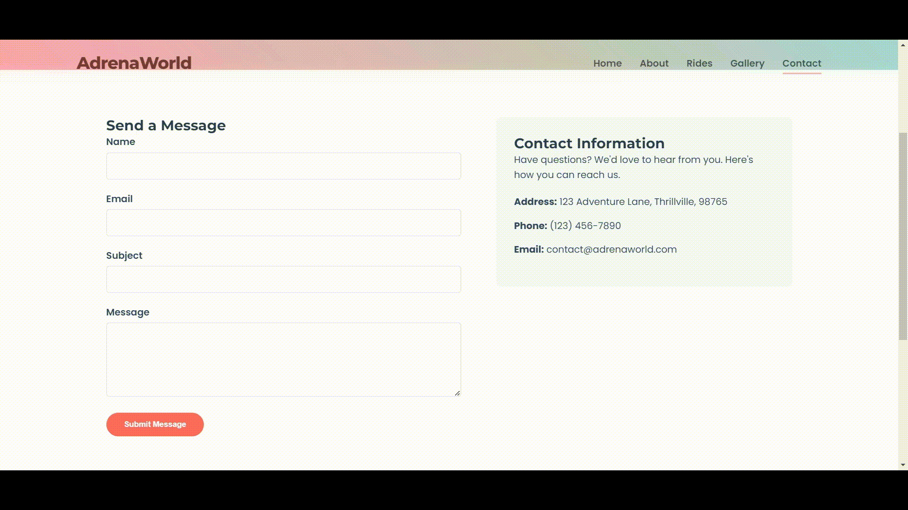

# DragFill

DragFill is Chrome extension which eliminates repetitive typing. It allows you to store your information once, and then simply drag and drop it into any input field to quickly fill out forms

# 🚀 Installation (Manual)

You can install this Chrome Extension locally by following these steps:

1. Clone or Download this Repository

2. Open Chrome Extensions Page
   
    Go to chrome://extensions/

3. Enable Developer mode (top right corner)

4. Load Unpacked Extension

5. Click “Load unpacked”

6. Select the folder where you cloned or extracted the extension

✅ Done!
You should now see the extension in your toolbar. Pin it if needed.
